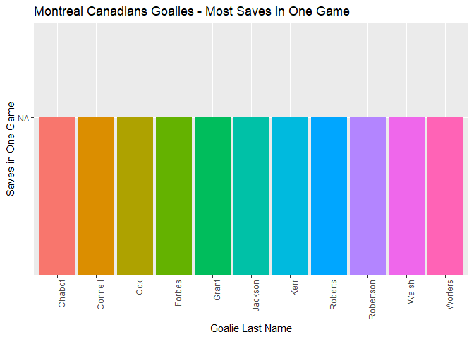
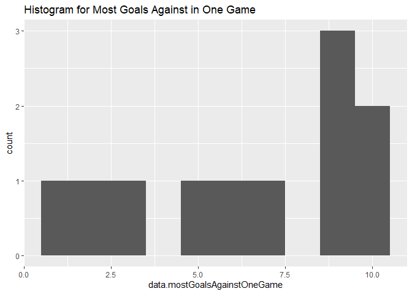
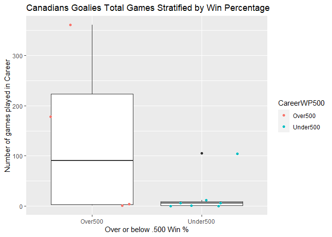
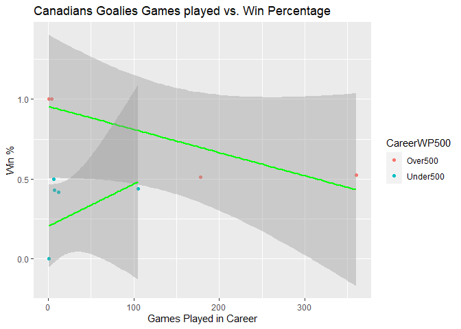
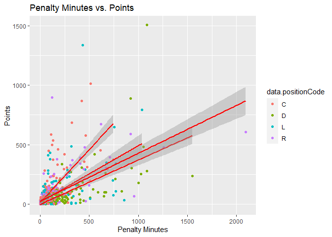

<<<<<<< HEAD
Project 1 Vignette
================
DRV
9/16/2020

``` r
knitr::opts_chunk$set(echo = TRUE)
```

``` r
library(rmarkdown)
render("C:/Users/drven/Documents/ST 558/Project-1/Proj1Vignette.Rmd", output_file= "README.md")
```

##### Packages required to create this vignette:

httr, jsonlite, dplyr, ggplot2, knitr, rmarkdown

### Contacting API

``` r
library(httr)
library(jsonlite)
library(dplyr)

### Franchise Data 
url1 <- "https://records.nhl.com/site/api/franchise"
call1 <- paste(url1)
get_franchise <- GET(call1)
get_franchise_text <- content(get_franchise, "text")
```

    ## No encoding supplied: defaulting to UTF-8.

``` r
get_franchise_json <- fromJSON(get_franchise_text, flatten=TRUE)
get_franchise_df <- as.data.frame(get_franchise_json)

### Franchise team Totals 
url2 <- "https://records.nhl.com/site/api/franchise-team-totals"
call2 <- paste(url2)
get_ftt <- GET(call2)
get_ftt_text <- content(get_ftt, "text")
```

    ## No encoding supplied: defaulting to UTF-8.

``` r
get_ftt_json <- fromJSON(get_ftt_text, flatten=TRUE)
get_ftt_df <- as.data.frame(get_ftt_json)

### All Time Record vs. Franchise 
url3 <- "https://records.nhl.com/site/api/all-time-record-vs-franchise?cayenneExp=teamFranchiseId="
function1 <- function(team){paste(url3,team,sep="")}

team <- "Bruins" #Insert Team Common Name or ID here 

call3 <- function1(ifelse(is.integer(team), team, switch(team, "Canadians" = 8, "Wanderers" = 41, "Eagles" = 45, "Tigers" = 37, "Maple Leafs" = 10, "Bruins" = 6, "Maroons" = 43, "Americans" = 51, "Quakers" = 39, "Rangers" = 3, "Blackhawks" = 16, "Red Wings" = 17, "Barons" = 49, "Kings" = 26, "Stars" = 25, "Flyers" = 4, "Penguins" = 5, "Blues" = 19, "Sabres" = 7, "Canucks" = 23, "Flames" = 20, "Islanders" = 2, "Devils" = 1, "Capitals" = 15, "Oilers" = 22, "Hurricanes" = 12, "Avalanche" = 21, "Coyotes" = 23, "Sharks" = 28, "Senators" = 9, "Lightening" =14, "Ducks" = 24, "Panthers" = 13, "Predators" = 18, "Jets" = 52, "Blue Jackets" = 29, "Wild" = 30, "Golden Knights" = 54)))

get_atrvf <- GET(call3)
get_atrvf_text <- content(get_atrvf, "text")
```

    ## No encoding supplied: defaulting to UTF-8.

``` r
get_atrvf_json <- fromJSON(get_atrvf_text, flatten=TRUE)
get_atrvf_df <- as.data.frame(get_atrvf_json)

### Franshice Goalie Records 
url4 <- "https://records.nhl.com/site/api/franchise-goalie-records?cayenneExp=franchiseId="
function2 <- function(team2){paste(url4,team2,sep="")}

team2 <- "Canadians" #Insert Team Common name or ID here 

call4 <- function2(ifelse(is.integer(team2), team2, switch(team2, "Canadians" = 8, "Wanderers" = 41, "Eagles" = 45, "Tigers" = 37, "Maple Leafs" = 10, "Bruins" = 6, "Maroons" = 43, "Americans" = 51, "Quakers" = 39, "Rangers" = 3, "Blackhawks" = 16, "Red Wings" = 17, "Barons" = 49, "Kings" = 26, "Stars" = 25, "Flyers" = 4, "Penguins" = 5, "Blues" = 19, "Sabres" = 7, "Canucks" = 23, "Flames" = 20, "Islanders" = 2, "Devils" = 1, "Capitals" = 15, "Oilers" = 22, "Hurricanes" = 12, "Avalanche" = 21, "Coyotes" = 23, "Sharks" = 28, "Senators" = 9, "Lightening" =14, "Ducks" = 24, "Panthers" = 13, "Predators" = 18, "Jets" = 52, "Blue Jackets" = 29, "Wild" = 30, "Golden Knights" = 54)))

get_fgr <- GET(call4)
get_fgr_text <- content(get_fgr, "text")
```

    ## No encoding supplied: defaulting to UTF-8.

``` r
get_fgr_json <- fromJSON(get_fgr_text, flatten=TRUE)
get_fgr_df <- as.data.frame(get_fgr_json)

### Franchise Skater Records 
url5 <- "https://records.nhl.com/site/api/franchise-skater-records?cayenneExp=franchiseId="

team3 <- "Bruins" #Insert Team Common name or ID here

function3 <- function(team3){paste(url5,team3, sep="")}

call5 <- function3(ifelse(is.integer(team3), team3, switch(team3, "Canadians" = 8, "Wanderers" = 41, "Eagles" = 45, "Tigers" = 37, "Maple Leafs" = 10, "Bruins" = 6, "Maroons" = 43, "Americans" = 51, "Quakers" = 39, "Rangers" = 3, "Blackhawks" = 16, "Red Wings" = 17, "Barons" = 49, "Kings" = 26, "Stars" = 25, "Flyers" = 4, "Penguins" = 5, "Blues" = 19, "Sabres" = 7, "Canucks" = 23, "Flames" = 20, "Islanders" = 2, "Devils" = 1, "Capitals" = 15, "Oilers" = 22, "Hurricanes" = 12, "Avalanche" = 21, "Coyotes" = 23, "Sharks" = 28, "Senators" = 9, "Lightening" =14, "Ducks" = 24, "Panthers" = 13, "Predators" = 18, "Jets" = 52, "Blue Jackets" = 29, "Wild" = 30, "Golden Knights" = 54)))

get_fsr <- GET(call5)
get_fsr_text <- content(get_fsr, "text")
```

    ## No encoding supplied: defaulting to UTF-8.

``` r
get_fsr_json <- fromJSON(get_fsr_text, flatten=TRUE)
get_fsr_df <- as.data.frame(get_fsr_json)

### NHL Stats Data 
url6 <- "https://statsapi.web.nhl.com/api/v1/teams/"
function4 <- function(team4, modifier){paste(url6, team4, modifier, sep="")}

team4 <- "Bruins" #Insert Team Common name or ID here

call6 <- function4(ifelse(is.integer(team3), team4, switch(team4, "Canadians" = 8, "Wanderers" = 41, "Eagles" = 45, "Tigers" = 37, "Maple Leafs" = 10, "Bruins" = 6, "Maroons" = 43, "Americans" = 51, "Quakers" = 39, "Rangers" = 3, "Blackhawks" = 16, "Red Wings" = 17, "Barons" = 49, "Kings" = 26, "Stars" = 25, "Flyers" = 4, "Penguins" = 5, "Blues" = 19, "Sabres" = 7, "Canucks" = 23, "Flames" = 20, "Islanders" = 2, "Devils" = 1, "Capitals" = 15, "Oilers" = 22, "Hurricanes" = 12, "Avalanche" = 21, "Coyotes" = 23, "Sharks" = 28, "Senators" = 9, "Lightening" =14, "Ducks" = 24, "Panthers" = 13, "Predators" = 18, "Jets" = 52, "Blue Jackets" = 29, "Wild" = 30, "Golden Knights" = 54)), "?expand=team.roster")

get_stats <- GET(call6)
get_stats_text <- content(get_stats, "text")
get_stats_json <- fromJSON(get_stats_text, flatten=TRUE)
get_stats_df <- as.data.frame(get_stats_json)
  
### Wrapper Function need to add name coercer 

function5 <- function(url, team5, modifier){
  call7 <- paste(url, ifelse(is.integer(team5), team5, switch(team5, "Canadians" = 8, "Wanderers" = 41, "Eagles" = 45, "Tigers" = 37, "Maple Leafs" = 10, "Bruins" = 6, "Maroons" = 43, "Americans" = 51, "Quakers" = 39, "Rangers" = 3, "Blackhawks" = 16, "Red Wings" = 17, "Barons" = 49, "Kings" = 26, "Stars" = 25, "Flyers" = 4, "Penguins" = 5, "Blues" = 19, "Sabres" = 7, "Canucks" = 23, "Flames" = 20, "Islanders" = 2, "Devils" = 1, "Capitals" = 15, "Oilers" = 22, "Hurricanes" = 12, "Avalanche" = 21, "Coyotes" = 23, "Sharks" = 28, "Senators" = 9, "Lightening" =14, "Ducks" = 24, "Panthers" = 13, "Predators" = 18, "Jets" = 52, "Blue Jackets" = 29, "Wild" = 30, "Golden Knights" = 54)), modifier, sep="") 
  get_data <- GET(call7) 
  get_data_text <- content(get_data, "text") 
  get_data_json <- fromJSON(get_data_text, flatten=TRUE) 
  get_data_df <- as.data.frame(get_data_json)
  }

### Testing Wrapper Function
get_data_df <- function5("https://statsapi.web.nhl.com/api/v1/teams/","Hurricanes","?expand=team.roster")
```

## Exploratory Data Analysis

### Joining Franchise Team Totals and Franchise Goalie Records on “data.franchiseId”

``` r
joined_data <- inner_join(get_ftt_df, get_fgr_df, by = c("data.franchiseId" =  "data.franchiseId"))
```

### Creating two new variables

``` r
get_fgr_df <- mutate(get_fgr_df, DepthChart= ifelse(get_fgr_df$data.gamesPlayed > 100, "Starter", "Backup")) 

get_fgr_df <- mutate(get_fgr_df, CareerWP500 = ifelse((get_fgr_df$data.gamesPlayed-get_fgr_df$data.losses)/data.gamesPlayed > .5, "Over500", "Under500"))
```

### Contingency tables

The first table shows that there is only one active starter and one
active backup grouped goalie, and that there are many more backup rated
goalies that are inactive when compared to starter rated goalies.

``` r
library(knitr)
firstctable <- as.data.frame(table(get_fgr_df$data.activePlayer, get_fgr_df$DepthChart))
kable(firstctable, caption = "Contingency Table for Player Status(Active/Not Active) vs. Experience More/Less than 100 games(Backup/Starter")
```

| Var1  | Var2    | Freq |
| :---- | :------ | ---: |
| FALSE | Backup  |    8 |
| FALSE | Starter |    3 |

Contingency Table for Player Status(Active/Not Active) vs. Experience
More/Less than 100 games(Backup/Starter

The second table shows that the two active goalies for the canadians
have a career Win Percentage of over 50% and that most of the goalies
that they have had which are now inactive, also mostly all have career
Win Percentage \> 50%.

``` r
secondctable <- as.data.frame(table(get_fgr_df$data.activePlayer, get_fgr_df$CareerWP500))
kable(secondctable, caption = "Contingency table for Games Played vs. Career WP > .500")
```

| Var1  | Var2     | Freq |
| :---- | :------- | ---: |
| FALSE | Over500  |    4 |
| FALSE | Under500 |    7 |

Contingency table for Games Played vs. Career WP \> .500

### Numerical Summaries for Numerical Variables grouped by Categorical Variables

The first numerical summary table shows the average \# of wins was much
greater for the Starter categorical variable compared to the backup.

``` r
ntable <- get_fgr_df %>% group_by(DepthChart) %>% summarise(avg = mean(data.wins), med = median(data.wins), var = var(data.wins))
```

    ## `summarise()` ungrouping output (override with `.groups` argument)

``` r
kable(ntable)
```

| DepthChart |      avg |  med |         var |
| :--------- | -------: | ---: | ----------: |
| Backup     |  1.37500 |  1.5 |    1.982143 |
| Starter    | 70.33333 | 57.0 | 1814.333333 |

The second numerical summary table shows that the average \# of shutouts
was much higher for goalies with a career Win percentages above 50%.

``` r
ntable2 <- get_fgr_df %>% group_by(CareerWP500) %>% summarise(avg = mean(data.mostShutoutsOneSeason), med = median(data.mostShutoutsOneSeason), var = var(data.mostShutoutsOneSeason))
```

    ## `summarise()` ungrouping output (override with `.groups` argument)

``` r
kable(ntable2)
```

| CareerWP500 |      avg | med |       var |
| :---------- | -------: | --: | --------: |
| Over500     | 5.500000 | 4.5 | 31.000000 |
| Under500    | 1.428571 | 0.0 |  8.619048 |

### Bar Plot

This bar plot shows the max saves in one game of all of the goalies that
have played for the Canadians. Above 50: Niemi, Plante, Price, Thomas.
These goalies can be inferred to have played a great singular game in
terms of the goalie position.

``` r
library(ggplot2)
ggplot(get_fgr_df, aes(x = data.lastName, y = data.mostSavesOneGame, color = data.lastName, fill=data.lastName)) + theme(axis.text.x=element_text(angle=90,hjust=1),legend.position = "none") + geom_col()+ggtitle("Montreal Canadians Goalies - Most Saves In One Game") + xlab("Goalie Last Name") + ylab("Saves in One Game") 
```

<!-- --> \#\#\# Histogram This
histogram shows that the majority of the canadians goalies had a max of
between 4 and 8 goals scored against them.

``` r
ggplot(get_fgr_df, aes(x = data.mostGoalsAgainstOneGame)) + geom_histogram(bins = 10) + ggtitle("Histogram for Most Goals Against in One Game") 
```

<!-- -->

### Box Plot

This boxplot shows that the majority of canadians goalies who have a
career win percentage above 50% played a lot more games than the goalies
that had a career win percentage of below 50%.

``` r
library(ggplot2)
ggplot(get_fgr_df, aes(x = CareerWP500, y = data.gamesPlayed)) + geom_boxplot() + 
  geom_jitter(aes(color = CareerWP500)) + ggtitle("Canadians Goalies Total Games Stratified by Win Percentage") + xlab("Over or below .500 Win %") + ylab("Number of games played in Career")
```

<!-- -->

# Scatter Plot

This scatter plot and the associated linear model shows that for the
goalies with a greater than 50% career win percentage, the more games
you play, the more your win % goes down.

``` r
ggplot(get_fgr_df, aes(x = data.gamesPlayed, y =((data.gamesPlayed-data.losses)/data.gamesPlayed) , group = CareerWP500)) + geom_point(aes(color = CareerWP500)) +     
   geom_smooth(method = 'lm', color = 'green') + ggtitle("Canadians Goalies Games played vs. Win Percentage")+ xlab("Games Played in Career") + ylab("Win %")
```

    ## `geom_smooth()` using formula 'y ~ x'

<!-- -->

# Final Plot

This scatter plot shows that here is somewhat of a correlation between
Penalty minutes and points, but this interaction can probably be
attributed mostly to another variable such as playing time.

``` r
ggplot(get_fsr_df, aes(x = data.penaltyMinutes, y = data.points, group = data.positionCode)) + geom_point(aes(color = data.positionCode)) +     
   geom_smooth(method = 'lm', color = "red") + ggtitle("Penalty Minutes vs. Points")+ xlab("Penalty Minutes") + ylab("Points")
```

    ## `geom_smooth()` using formula 'y ~ x'

<!-- -->
=======
## Welcome to GitHub Pages

You can use the [editor on GitHub](https://github.com/drvend/Project-1/edit/master/README.md) to maintain and preview the content for your website in Markdown files.

Whenever you commit to this repository, GitHub Pages will run [Jekyll](https://jekyllrb.com/) to rebuild the pages in your site, from the content in your Markdown files.

### Markdown

Markdown is a lightweight and easy-to-use syntax for styling your writing. It includes conventions for

```markdown
Syntax highlighted code block

# Header 1
## Header 2
### Header 3

- Bulleted
- List

1. Numbered
2. List

**Bold** and _Italic_ and `Code` text

[Link](url) and 
```

For more details see [GitHub Flavored Markdown](https://guides.github.com/features/mastering-markdown/).

### Jekyll Themes

Your Pages site will use the layout and styles from the Jekyll theme you have selected in your [repository settings](https://github.com/drvend/Project-1/settings). The name of this theme is saved in the Jekyll `_config.yml` configuration file.

### Support or Contact

Having trouble with Pages? Check out our [documentation](https://docs.github.com/categories/github-pages-basics/) or [contact support](https://github.com/contact) and we’ll help you sort it out.
>>>>>>> 4fc04c3c9b60b688f07ea2e74eb61b4114a27339
